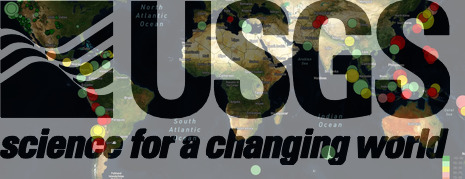
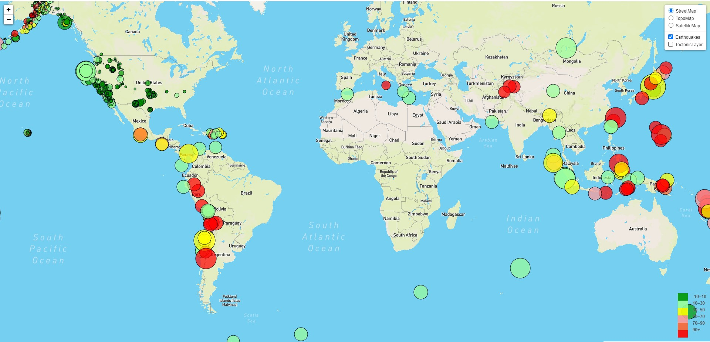
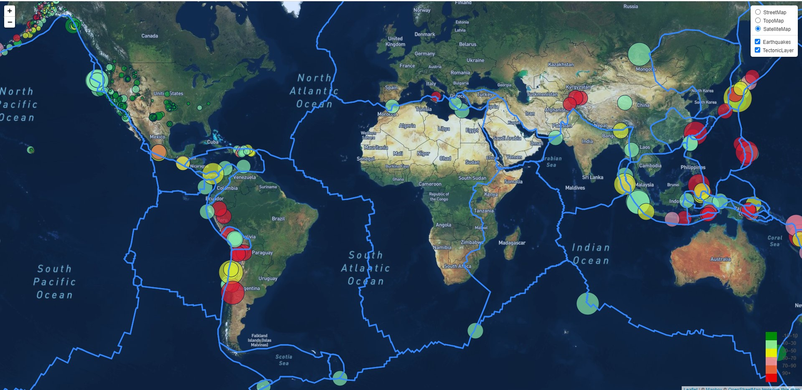
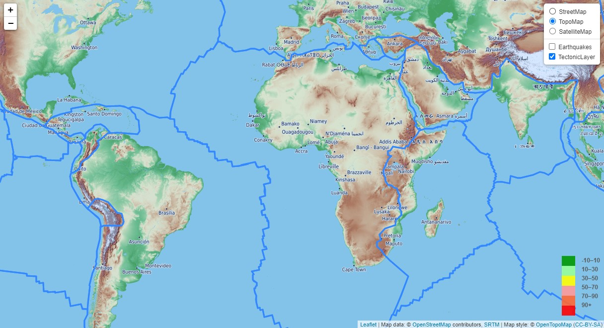

# Leaflet Homework - Visualizing USGS Earthquake Data with Leaflet.js





## Table of contents
* [Project Title ](#project-title)
* [Description](#description)
* [Objective](#objective)
* [Screen Shots](#screen-shots)
* [Technologies](#technologies)
* [Code](#code)
* [Status](#status)
* [Acknowledgement ](#acknowledgement )
* [Contact](#contact)


## Project Title : USGS Interactive Seismic Map

### Description 
This project aims at building a interactive Seismic Map for United States Geological Survey.Their hope is that being able to visualize earthquake data to better educate the public and other government organizations on issues facing our planet.

### Data Set
- The [USGS](https://earthquake.usgs.gov/earthquakes/feed/v1.0/geojson.php) provides earthquake data in a number of different formats, updated every 5 minutes.
-  Dataset is based on [All Earthquakes for past 7days](https://earthquake.usgs.gov/earthquakes/feed/v1.0/summary/all_week.geojson) in JSON format.

_ __Techtonic Plates__ : 
	Data on tectonic plates can be found at [https://github.com/fraxen/tectonicplates.](https://github.com/fraxen/tectonicplates.)

## Objective
### Step 1 - Get [API endpoint](https://earthquake.usgs.gov/earthquakes/feed/v1.0/summary/all_week.geojson) (dataset) for the past week of earthquake data.

### Step 2 - Import & Visualize the Data - Create base maps
- Create base maps using Leaflet tiles for the lat and lngs provided in the API.
- Create a marker layer for the earthquake data:
	* Markers should reflect the magnitude of the earthquake by their size.
	* Depth of the earth quake by color.
	* Earthquakes with higher magnitudes should appear larger.
	* Earthquakes with greater depth should appear darker in color.
- Create a toggle control.

### Step 3 - Add Tectonic Plates.
- Plot a second data set on your map to illustrate the relationship between tectonic plates and seismic activity.
- Add the layer to the toggle control.
### Step 4 - Toggle control
- Add a number of base maps to choose from as well as separate out our two different data sets into overlays that can be turned on and off independently.
- Add layer controls to our map.

### Step 5 - Render ToolTip and Create a Legend
- Include popups that provide additional information about the earthquake when a marker is clicked. 
- Create a legend that will provide context for your map data.
- legend must include depth and their corresponding color.


## Screen Shots

### Step 1 - Street map with markers for earthquake


### Step 2 - Satellite map with markers and Tectonic plate.


### Step 3 - Topomap with Tectonic plate.




## Technologies and Tools
* Visual Studio Code Editor
* GitBash, GitHub , Git Pages
* chrome DOM
* HTML , CSS, Bootstrap
*Mapbox API for basemaps
* JavaScript
#### Java Script Libraries and plugins :
* D3.js	
* leaflet.js

	

## Code 
- [Leaflet.js Code](/assets/js/app.js)

## Setup
- Git clone with HTTPS link
- Git bash and run python server to render the page on port 8000
- play with leaflet map and toggle control
- Open [Leaflet.js Code](/assets/js/app.js) in visual studio

## Status
Project Complete

## Acknowledgement 
- UTSA BootCamp
- Jeff Anderson(Boot Camp Instructor for being the best)
- [stackoverflow.com for helping with assigning text to each circle](https://stackoverflow.com/questions/44339929/put-text-in-the-middle-of-a-circle-using-d3-js)



## Contact
 [Divya Shetty](https://github.com/divya-gh)
